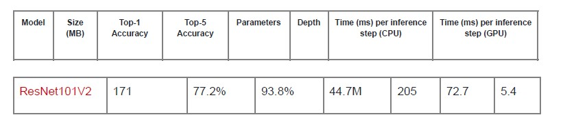

# cnn

8INF804-Traitement numerique des images.
Hiver 2022
Professeur : Julien Lemaitre

Contributeurs
- Nihal OUHAOUADA 
- Pierre LACLAVERIE 
- Thibaud SIMON 
- Yann REYNAUD 

Python, Tensorflow, keras, google Colab

# Sommaire
- [cnn](#cnn)
- [Sommaire](#sommaire)
- [Objectifs](#objectifs)
- [Choix et analyse du Dataset](#choix-et-analyse-du-dataset)
- [Transfert learning](#transfert-learning)
  - [Résultats](#résultats)
- [From Scratch](#from-scratch)
- [Comparaison](#comparaison)
- [Conclusion](#conclusion)

# Objectifs

Manipuler la création d’architecture de réseaux de neurones convolutifs, manipuler le concept du transfer learning, et comparer les performances obtenues sur un ensemble de données d’images.

Pour une description plus détaillé, voici le [sujet](TP3/Ress/pdf/Sujet%20-%20TP3.pdf) ainsi que le [rapport](TP3/Ress/pdf/8INF804%20-%20TP3%20-%20Rapport.pdf). La procédure pour l'execution est détaillée [ici](TP3/Ress/pdf/README%20-%20Execution%20et%20utilisation.pdf)

# Choix et analyse du Dataset 

Après recherche sur la banque de données Kaggle, nous sommes tombés sur le dataset
“Simpson Images” qui nous a satisfait pour les raisons suivantes:
- Ce sont des simpsons : parle à tout le monde
- Le dataset est complet et sa taille est raisonnable (moins de 500mo)
- Le dataset propose un set de test préparé et équitable de 50 images par classe
- Le dataset propose un set de training assez complet, avec des images en grande
quantité, surtout pour les personnages principaux.
- La résolution des images n’est pas trop grande permettant d’éviter les longs temps
de chargement.

 Cependant, ce Dataset à le défaut d'avoir des classes sur-représentées (homer simpson: 2000+ images) et des classes sous représentées (lenny leonard : - 100 images).

Ci-dessous la distribution des catégories.

On divise alors notre dataset en trois catégories : 
- Training
- Validation
- Test 

Comme suis.

# Transfert learning

En premier lieu nous nous sommes documentés sur les différentes architectures existantes. Nous avons choisit de prendre ResNet101V2 pour faire le transfert learning. Cette architecture représente un bon compromis entre entrainement et efficacité, c'est pourquoi nous l'avons choisi. Ci-dessous les informations extraites de la documentation keras.

Nous avons décidé de choisir le modèle ResNet101V2 car son accuracy Top-5 est très
bonne (93.8%), mais surtout car même s’il prend plus de place (size en MB) que Xception, il
est près de 1,5 fois plus rapide à calculer sur le GPU, ce qui est un critère très intéressant
pour notre équipe, car cela aura un impact direct sur le temps d’entraînement.
Pour résumer, ResNet101V2 nous semble être un très bon compromis entre rapidité
d'exécution et qualité des résultats.

## Résultats 

La méthode pas à pas est décrite dans le [rapport](TP3/Ress/pdf/8INF804%20-%20TP3%20-%20Rapport.pdf), on se concentrera ici sur les résultats.

L'accuracy est bon, plus de 85 % en moyenne sur 5 itérations de l'entrainement.

De même, il est possible de visualiser l'évolution des pertes et de l'accuracy du modèle durant les epochs.

Enfin, le Kappa score est de 0.94. Ce qui est très satisfaisant. 
Pour plus de détails sur les résultats (F1 score pour chaque classe, precision, recall, ...) se referer au [rapport](TP3/Ress/pdf/8INF804%20-%20TP3%20-%20Rapport.pdf).

Le développement a été très rapide avec le transfert learning et a permis d'avoir des résultats intéréssants.

# From Scratch

Nous avons alors tenté de faire nous-même un réseau de neurones convolutifs pour la classification de ces images des simpsons.

A la suite du [rapport](TP3/Ress/pdf/8INF804%20-%20TP3%20-%20Rapport.pdf) se trouve le détail de l'implémentation du CNN.

Au niveau de la précision, un surajustement apparaît au cours des epochs.

En ajustant le modèle, on arrive à ce résultat :

On remarque qu’après avoir appliquer les modifications précédentes, il y a moins
d’overfitting et les 2 précisions (entraînement et validation) sont plus proches. Peut être
qu’en augmentant le nombre d’epochs (initialement fixé à 25) les courbes vont continuer à
s’améliorer.
Sur nos données de test, nous avons une accuracy qui vaut 71.58% :

Plus de détails sur le [rapport](TP3/Ress/pdf/8INF804%20-%20TP3%20-%20Rapport.pdf)

# Comparaison 

Le tableau ci-dessous permet de comparer les deux approches

# Conclusion 

Dans le cadre de notre sujet, il est préférable de faire le transfert learning plutôt que de
coder à partir de rien notre réseau de neurones. En effet, cette méthode permet
d’économiser en temps de recherche car il est plus facile d’adapter une architecture de
référence que d’en construire une à partir de rien. Les résultats sont aussi de nature
différentes : avec le transfert learning on obtient des résultats très satisfaisant tandis qu’ils
sont moins intéressants quand on regarde ce qui a été fait avec le réseau de neurone fait à
partir de rien.
Il est donc préférable de regarder si des architectures existantes ne permettent pas de
résoudre le problème au lieu de créer un modèle.